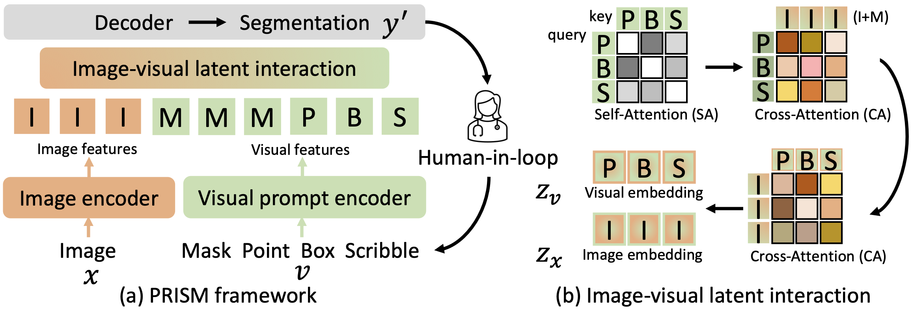
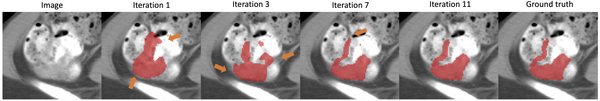

# PRISM
PRISM: A **P**romptable and **R**obust **I**nteractive **S**egmentation **M**odel with Visual Prompts

## News


[03/07/24] The [pretrained PRISM](https://drive.google.com/drive/u/1/folders/1B6Df44Gd9PEBGPkE1FwC8Ds4jefCekUB) models and [preprocessed datasets](https://drive.google.com/drive/folders/13uGNb2WQhSQcBQIUhnvYJere1LBYGDsW?usp=sharing) are uploaded.

## TODO


demo (gradio)


## What is PRISM?


PRISM is a robust model/method for interactive segmentation in medical imaging. We strive for human-level performance, as a human-in-loop interactive segmentation model with prompts should gradually refine its outcomes until they closely match inter-rater variability. 


## PRISM tumor segmentation examples
Quantitative results is avaliable in paper (provide a link). 

Briefly, PRISM produces tumor segmentation with mean Dice values of **93.79 (colon), 94.48 (pancreas), 94.18 (liver), and 96.58 (kidney)**.

  |   |   |
:-------------------------:|:-------------------------:
Iterative correction for colon tumor | 
Iterative correction for multiple tumors | 
Qualitative results with compared methods | 


## Datasets
The anatomical differences among individuals and ambiguous boundaries are present in the datasets.

- Our preprocessed
  
     We used four public [datasets](https://drive.google.com/drive/folders/13uGNb2WQhSQcBQIUhnvYJere1LBYGDsW?usp=sharing) for 3D tumor segmentation in [colon](https://drive.google.com/drive/u/1/folders/1bt17794HCZfmJ2MLh5w0Y_IAJyUj6ti2), [pancreas](https://drive.google.com/drive/u/1/folders/1NncGDG5Cu795WJTmBse-Lm0GrJmtvTdc), [liver](https://drive.google.com/drive/u/1/folders/1vDM2VkNAT5dvFX5XTRhPe6b7zwYWqU_U) and [kidney](https://drive.google.com/drive/u/1/folders/12UDho-JEZHfK1c1laD5dBFNxvJumcoDF). 

- Original
 
     Here are the links for the datasets: [MSD-colon](http://medicaldecathlon.com/), [MSD-pancreas](http://medicaldecathlon.com/), [LiTS2017](https://competitions.codalab.org/competitions/17094) and [KiTS2021](https://kits-challenge.org/kits21/).


## Models
| colon | pancreas | liver | kidney |
|------------------------------|------------------------------|------------------------------|------------------------------|
| [Download](https://drive.google.com/drive/u/1/folders/1nPUC0cCsyA_w-tKkhL_Bw7lesBorGzCl) |[Download](https://drive.google.com/drive/u/1/folders/1JPiF7wtSnbFdl0ZLmFQt1b4H-XH4FDrM)| [Download](https://drive.google.com/drive/u/1/folders/1JAFOca1FxWebzZjRa1lKo1OAv0HXqeh6) |[Download](https://drive.google.com/drive/u/1/folders/1sN0HQLM-LfWB5Kp119YwMsZIfv3VJj7S)|


## Get Started

**Installation**
```
conda create -n prism python=3.9
conda activate prism
sudo install git
pip install torch==1.12.1+cu113 torchvision==0.13.1+cu113 --extra-index-url https://download.pytorch.org/whl/cu113 # install pytorch
pip install git+https://github.com/facebookresearch/segment-anything.git # install segment anything packages
pip install git+https://github.com/deepmind/surface-distance.git # for normalized surface dice (NSD) evaluation
pip install -r requirements.txt
```


**Train**

```
python train.py --data colon --data_dir your_data_directory --save_name your_save_name --multiple_outputs --dynamic --use_box --refine
```


**Train (Distributed Data Parallel)**

the only difference between this and above (train) command is the use of "--ddp".
```
python train.py --data colon --data_dir your_data_directory --save_name your_save_name -multiple_outputs --dynamic --use_box --refine --ddp
```


**Test**

put downloaded pretrained model under the implementation directory
```
python test.py --data colon --data_dir your_data_directory --split test --checkpoint best --save_name prism_pretrain --num_clicks 1 --iter_nums 11 --multiple_outputs --use_box --use_scribble --efficient_scribble --refine --refine_test
```


**FAQ**

if you got the error as AttributeError: module 'cv2' has no attribute 'ximgproc', please check [this](https://stackoverflow.com/questions/57427233/module-cv2-cv2-has-no-attribute-ximgproc) out

DDP mode has lower Dice and more epoch numbers may solve it

On my end, combining trainer and trainer_basic speeds up

training the model without refine module (as we reported in the paper) has better accuracy than with refine but not using it


## License

The model is licensed under the [Apache 2.0 license](LICENSE)


## Acknowledgements

+ [SAM](https://github.com/facebookresearch/segment-anything)
+ [SAM-Med3D](https://github.com/uni-medical/SAM-Med3D)
+ [ProMISe](https://github.com/HaoLi12345/PRISM)
+ [nnU-Net](https://github.com/MIC-DKFZ/nnUNet)

If you find this repository useful, please consider citing this paper:
```
@article{li2023promise,
  title={Promise: Prompt-driven 3D Medical Image Segmentation Using Pretrained Image Foundation Models},
  author={Li, Hao and Liu, Han and Hu, Dewei and Wang, Jiacheng and Oguz, Ipek},
  journal={arXiv preprint arXiv:2310.19721},
  year={2023}
}
```
Please send an email to hao.li.1@vanderbilt.edu for any questions and always happy to help! :)
